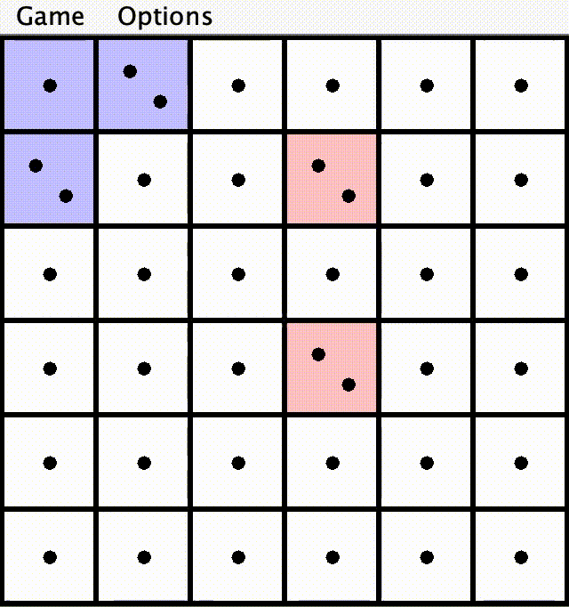

# Jumping Cube

## Demo

## Game Details
Jumping Cube is a two-person, pure strategy, board game. The goal is for the a player to take over the board with their team color. This game involves no element of chance and allows a user to play against a computer or against another person, or to allow the computer to play itself. 

## Implementation
Implemented the game functionality in Java. The AI was built using the minimax algorithm to decide what is the next best move and alpha-beta pruning to improve the efficiency of the decision making process. Connected the backend to a graphical interface (GUI) that was implemented using Graphics2D. Used JUnit for both unit and integration testing.

## Rules
The game board consists of an N×N array of squares, where N>1. At any time, each square may have one of three colors: red, blue, or white (neutral), and some number of spots (as on dice). Initially, all squares are white and have one spot.

For purposes of naming squares in this description, we'll use the following notation: r:c refers to the square at row r and column c, where 1≤ r, c ≤N. Rows are numbered from top to bottom (top row is row 1) and columns are numbered from the left. When entering commands, we replace the colon with a space (this being easier to type).

The neighbors of a square are the horizontally and vertically adjacent squares (diagonally adjacent squares are not neighbors). We say that a square is overfull if it contains more spots than it has neighbors. Thus, the four corner squares are overfull when they have more than two spots; other squares on the edge are overfull with more than three spots; and all others are overfull with more than four spots.

There are two players, whom we'll call Red and Blue. The players each move in turn, with Red going first. A move consists of adding one spot on any square that does not have the opponent's color (so Red may add a spot to either a red or white square). A spot placed on any square colors that square with the player's color.

After the player has moved, we repeat the following steps until no square is overfull or either all squares are red or all blue:
- Pick an overfull square.
- For each neighbor of the overfull square, move one spot out of the square and into the neighbor (even
if occupied by the opposing side).
- Give each of these neighboring squares the player's color (if they don't have it already).

The order in which this happens, as it turns out, does not usually matter—that is, the end result will be the same regardless of which overfull square's spots are removed first, with the exception that the winning position might differ. A player wins when all squares are the player's color.